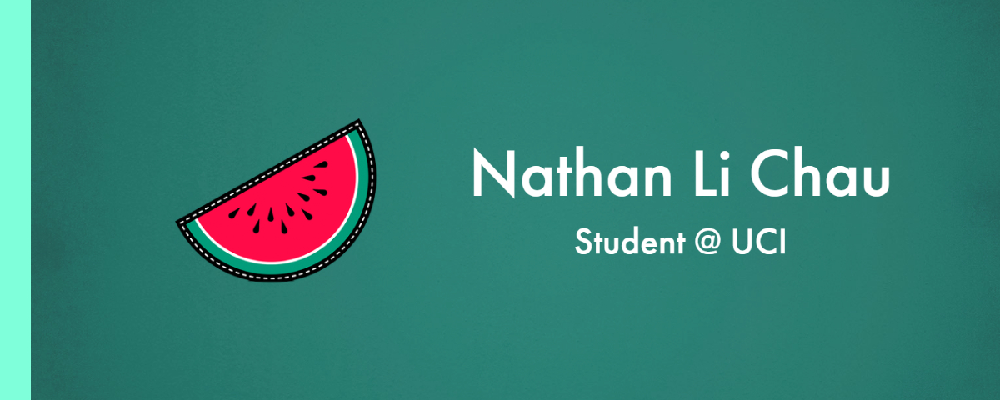

### Hi there! I'm Nathan, a 1st year Electrical Engineering (Changing to Computer Science) Student @ UCI. 
I've always been interested in hardware and software aspect of computers. My current goal is to learn how to develop an application and a website, but I also wish to learn about other languages and frameworks such as: C++, React, Node.js, and more. My hobbbies are video games, anime, and guitar. Looking forward to meeting you! 

### Clubs:  
- Hack @ UCI
- ICSSC (Information and Computer Science Student Council)
- JSA (Japanese Student Association)  

Check out my [LinkedIn](https://www.linkedin.com/in/nlchau2004/)

<!--
**Nlchau2004/Nlchau2004** is a ✨ _special_ ✨ repository because its `README.md` (this file) appears on your GitHub profile.

Here are some ideas to get you started:

- 🔭 I’m currently working on ...
- 🌱 I’m currently learning ...
- 👯 I’m looking to collaborate on ...
- 🤔 I’m looking for help with ...
- 💬 Ask me about ...
- 📫 How to reach me: ...
- 😄 Pronouns: ...
- ⚡ Fun fact: ...
-->
